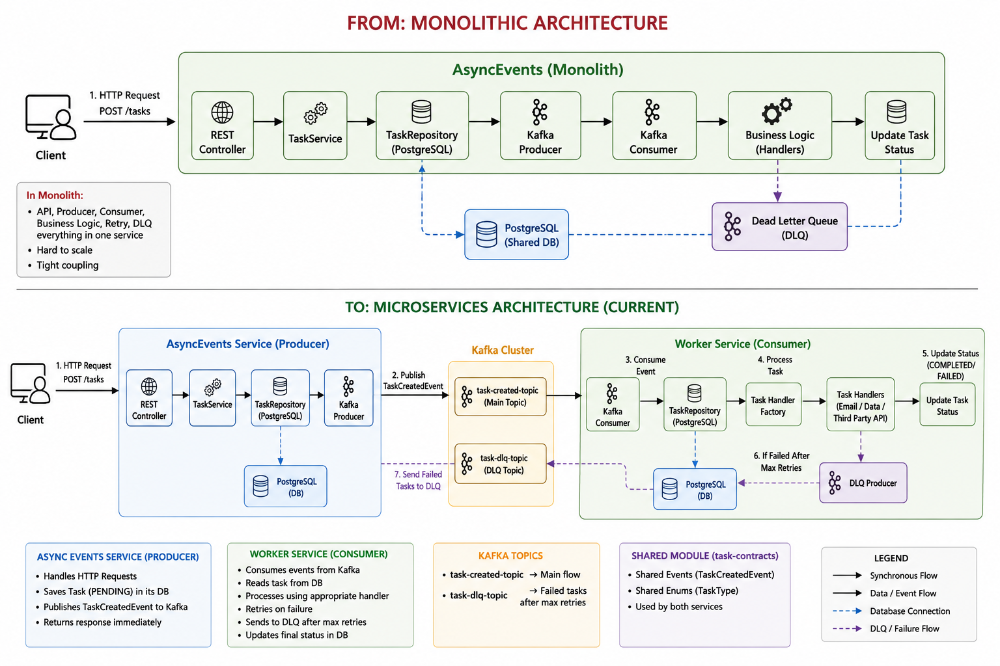

      # TaskForge

A distributed asynchronous task processing platform designed to handle high volumes of background jobs reliably and efficiently.

TaskForge enables applications to offload time-consuming operations such as notifications, data processing, and third-party API integrations into asynchronous workflows, improving responsiveness, scalability, and fault tolerance.

---

## Problem Statement

Modern applications often perform operations that are slow, failure-prone, or dependent on external services.

Examples include:

* Sending emails and notifications
* Generating reports and analytics
* Processing large datasets
* Calling external APIs such as GitHub, OpenAI, or payment gateways

Executing these operations synchronously increases response time and reduces system reliability.

TaskForge addresses this by decoupling task creation from task execution using an asynchronous, event-driven architecture.

---

## Features

### Notification Processing

* Email notifications
* SMS notifications
* Push notifications
* Retry support
* Dead Letter Queue (DLQ) handling

### Data Processing

* Report generation
* CSV exports
* Log analysis
* Analytics aggregation

### Third-Party API Integrations

* GitHub API analysis
* OpenAI API integrations
* Weather API processing
* Payment provider integrations

### Reliability Features

* Idempotent task execution
* Automatic retries
* Dead Letter Queues
* Rate limiting
* Failure recovery

---

## Architecture

                Client
                   │
                   ▼
            Task Controller
                   │
                   ▼
             Task Service
                   │
                   ▼
              PostgreSQL
              (Task Table)
                   │
                   ▼
                 Kafka
                   │
         ┌─────────┼─────────┐
         ▼         ▼         ▼
 Notification   Data      API
   Worker     Worker    Worker
         │         │         │
         ▼         ▼         ▼
      Email     Report    GitHub
      SMS       Logs      OpenAI

## Task Lifecycle

PENDING

↓

PROCESSING

↓

COMPLETED

or

PENDING

↓

PROCESSING

↓

FAILED

↓

RETRY

↓

DLQ

---

## Tech Stack

### Backend

* Java
* Spring Boot

### Database

* PostgreSQL

### Messaging

* Apache Kafka

### Cache

* Redis

### Infrastructure

* Docker
* Kubernetes(Future Prospect)

### Monitoring

* Spring Boot Actuator

---

## Task Types

### Notification Tasks

Examples:

* Connection Request Email
* Welcome Email
* Password Reset Notification

### Data Processing Tasks

Examples:

* Activity Report Generation
* CSV Export
* Log Analytics

### Third Party API Tasks

Examples:

* GitHub Repository Analysis
* OpenAI Content Generation
* Weather Data Collection

---

## Future Enhancements

* Kafka Consumer Groups
* Distributed Scheduling
* Debezium CDC Integration
* Multi-Tenant Task Processing
* Metrics Dashboard
* Task Priority Queues
* Kubernetes Horizontal Scaling

---

## Learning Objectives

This project demonstrates:

* Event Driven Architecture
* Distributed Systems Concepts
* Message Queues
* Fault Tolerance
* Microservices Communication
* Retry and Recovery Mechanisms
* Database Design
* Scalability Patterns

                                        +--------------------+
                                        |       Client       |
                                        +---------+----------+
                                                  |
                                             HTTP Request
                                                  |
                                                  v
                               +----------------------------------+
                               |       AsyncEvents Service        |
                               |----------------------------------|
                               | Controller                       |
                               | TaskService                      |
                               | TaskRepository                   |
                               | PostgreSQL                       |
                               | Kafka Producer                   |
                               +----------------+-----------------+
                                                |
                                      TaskCreatedEvent
                                                |
                                                v
                                   +-------------------------+
                                   |          Kafka          |
                                   |-------------------------|
                                   | task-created-topic      |
                                   | task-dlq-topic          |
                                   +------------+------------+
                                                |
                                                |
                                                v
                              +-----------------------------------+
                              |        Worker Service             |
                              |-----------------------------------|
                              | Kafka Consumer                    |
                              | TaskRepository                    |
                              | TaskHandlerFactory                |
                              | EmailTaskHandler                  |
                              | DataProcessingTaskHandler         |
                              | ThirdPartyApiTaskHandler          |
                              | Retry Logic                       |
                              | DLQ Producer                      |
                              | PostgreSQL                        |
                              +----------------+------------------+
                                               |
                                               |
                              +----------------+----------------+
                              |                |                |
                              v                v                v
                     Email Service     Data Processing    Third Party API

                     